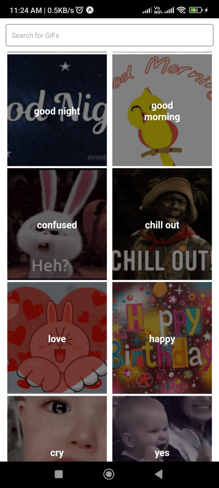
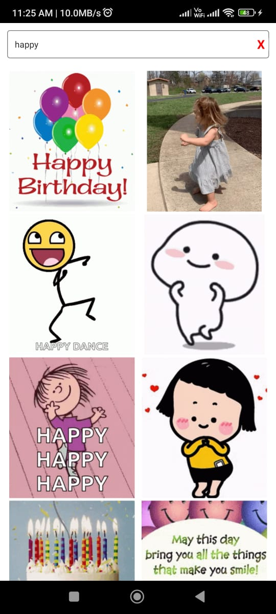

# expo-tenor-search

<!-- > A component for react native tenor gif search. -->

[](https://www.npmjs.com/package/expo-tenor-search) [](https://standardjs.com)

The expo-tenor-search component allows you to easily integrate Tenor GIFs into your React Native app. It features a user-friendly interface. This package is perfect for enhanceing your app's visual appeal and engage users with high-quality animated GIFs.

This package supports Tenor V2 APIs

## Install

Open a Terminal in the project root and run:

```bash
yarn add expo-tenor-search
```

## Usage

The `GifSearch` component is the main feature of the extension.
Here are the features of the GifSearch component based on the code provided:

- Customizable Search Filters: You can customize the search filters to provide only the type of GIFs that you want to show in your app. In the code, the MediaFilter parameter is set to 'minimal', which limits the search results to only show GIFs that are safe for all ages.
- Easy GIF Selection: The onGifSelect function is called when the user selects a GIF. A function `handleGifSelect` is provided that returns the selected GIF's URL.
- Tenor API Key: To use the GifSearch component, you need to provide a Tenor API key. In the code, the tenorkey parameter is used to provide the API key. You can obtain an API key from Tenor's developer portal.

## What to do with the results 
After selecting the GIF, you can define the next process to be done using the `handleGifSelect` function. It will return an object containing the properties and metadata of the selected GIF in the `data` parameter.
## Adding Custom styles
You can customize the styling of the component by passing in your own styles as props. There are two parts to the styles - the search box styles and the gif box styles.

For the search box, you can pass in CSS selectors using the following props:

- `searchContainer`: Sets the style properties for a container element that contains a search bar.
- `closeButton`: Sets the style properties for a button that allows the user to clear the search bar.
- `closeButtonText`: Sets the style properties for the text inside the close button.

To modify the styles of the gif, you can use the following selectors:

* `button`: Sets the style properties for a button element and changes the default appearance of the button.
* `.row`: This selector sets the display to "flex" and sets the flex-wrap property to "wrap".
* `.column`: Sets various style properties for an element with a class of "column". This selector sets the maximum width to 50%.
* `.giftext`: Sets the style properties for an element with a class of "giftext". This selector affects the text shown in the gif categories page.
* `img`: Sets the style properties for an img element.

### Examle implementation

```jsx
import { GifSearch } from 'expo-tenor-search'

export default function GifScreen() {
  const handleGifSelect = (data) => {
    console.log(`Selected GIF: ${data}`)
  }

  const styles = {
    searchbox: {
      searchContainer: {
        height: 45
      }
    },
    gifbox: {
      img: {
        borderRadius: '10px'
      }
    }
  }
  return (
    <GifSearch
      tenorkey={'xxx-xxx-xxx-xxx'}
      MediaFilter={'minimal'}
      onGifSelect={handleGifSelect}
      styles={styles}
    />
  )
}
```

[](doc/high-level.md#ref.drawImage)

[](doc/high-level.md#ref.drawImage)

## License

MIT © [Hexmos Technologies](https://github.com/HexmosTech)
